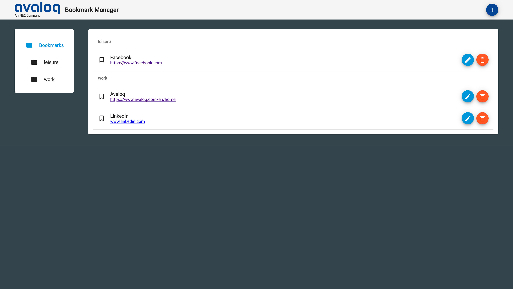
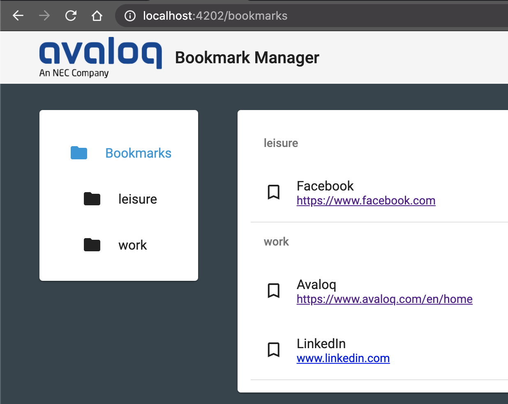
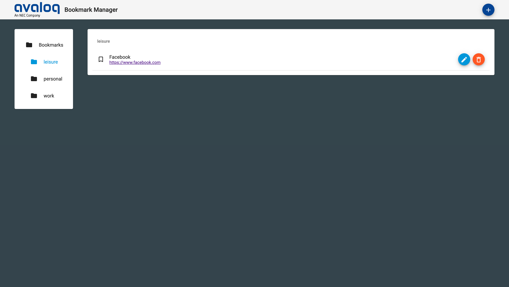
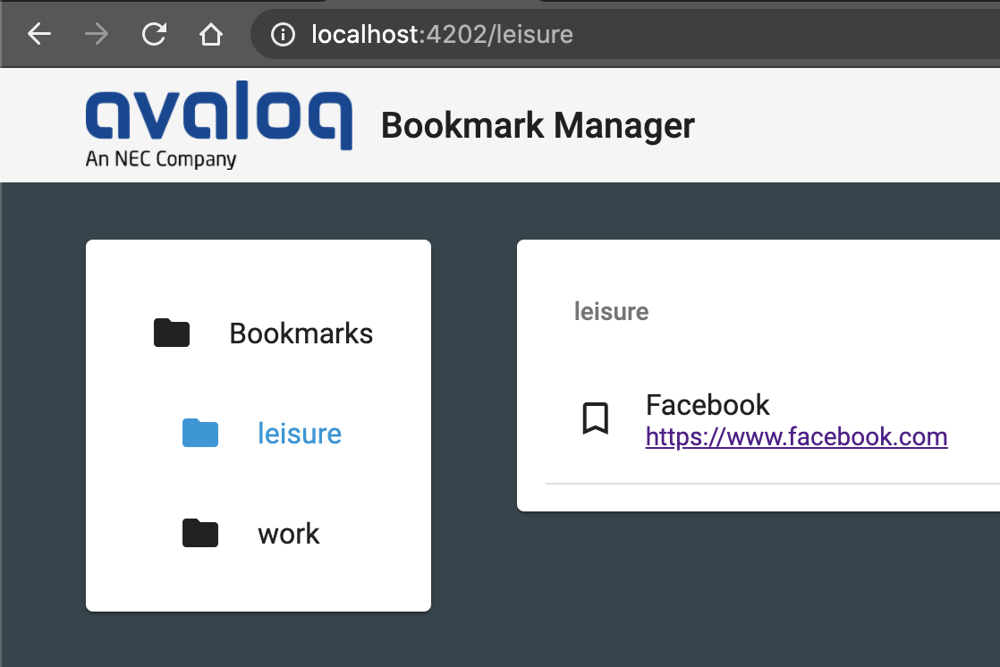
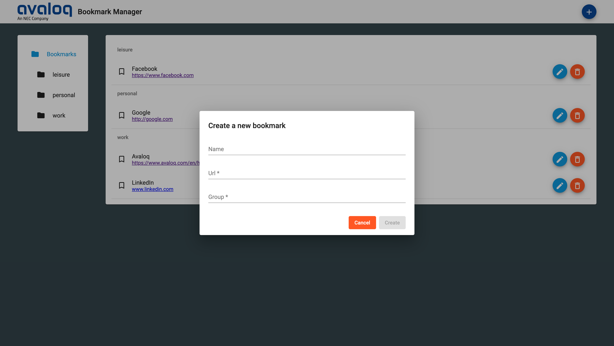
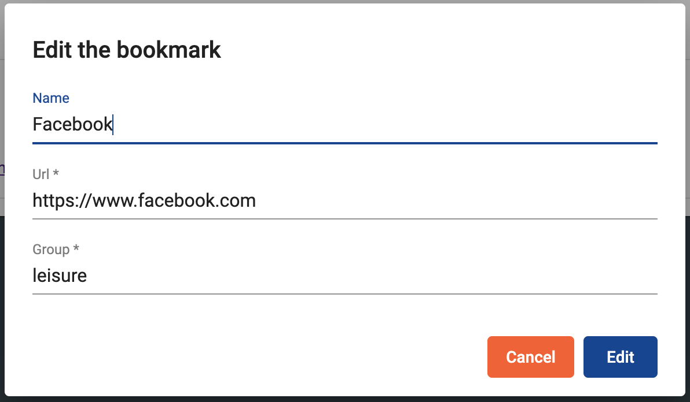
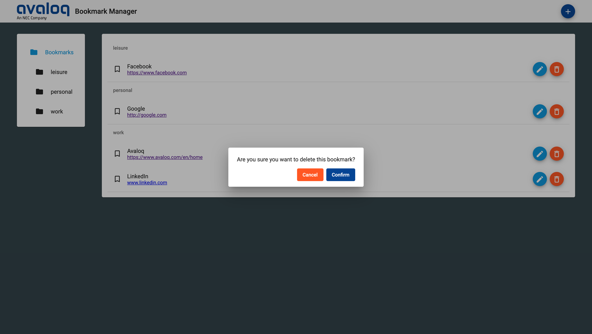

# Bookmark Manager
This is a very basic project for managing bookmarks, powered by NgRx and Angular Material. The design it's been inspired by the Google Bookmark Manager and the theme colors of [Avaloq](https://www.avaloq.com/en/home "Avaloq's Homepage")

## Features
List of the use cases handled by this application:

### view all bookmarks, grouped by their respective group


### view all bookmarks, for a given group


### create a bookmark

### edit a bookmark

### delete a bookmark


Every bookmark has the following properties:
- name (optional)
- url
- group

# Technical infos
Design has been created using Angular Material at its best, with a sprinkle of flex layout for the base structure. There is no database whatsoever but the state management using NgRx.

Highlights of what has been used in order to build this application:
- dialogs
- reactive forms
- NgRx
- NgRx-devtools
- routing
- Angular flex-layout
- Angular Material theming

## State management
The state management has been achieved using NgRx.

The initial state is composed of dummy data.

### File structure
- store
    - bookmarks
        - bookmark.model.ts
        - bookmarks.actions.ts
        - bookmarks.facade.ts
        - bookmarks.reducers.ts
        - bookmarks.state.ts

### State
```typescript
export class BookmarksState {
  constructor(public bookmarks: Bookmark[]) {}
}
```

### Actions
```typescript
EDIT_BOOKMARK   = '[Bookmark] Edit bookmarks',
CREATE_BOOKMARK = '[Bookmark] Create bookmarks',
DELETE_BOOKMARK = '[Bookmark] Delete bookmark',
```

### Facade
The facade handles most of the logic, decoupled from the presentation layer, with the use of selectors, connecting with the store and sending events (actions)

## How to run the application
1. Run `npm install`
2. Run `npm start`
3. Navigate to `http://localhost:4202/`

